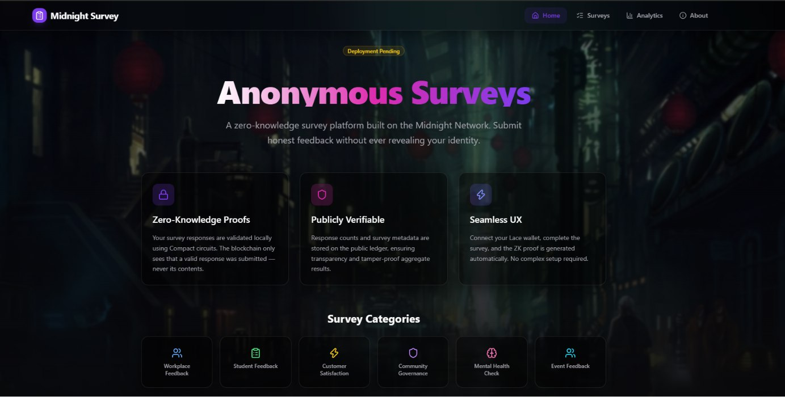
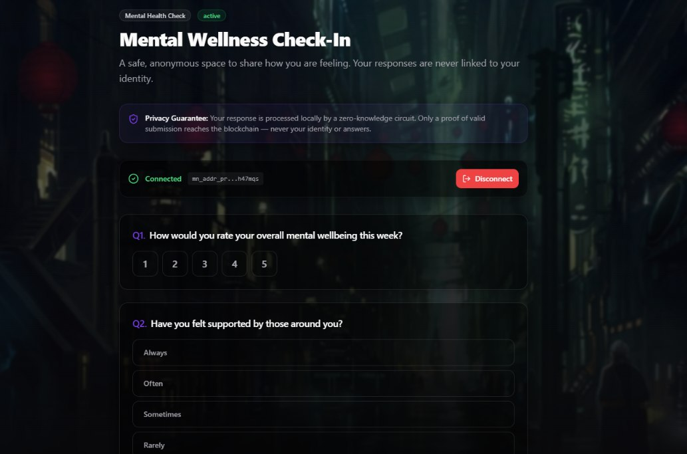
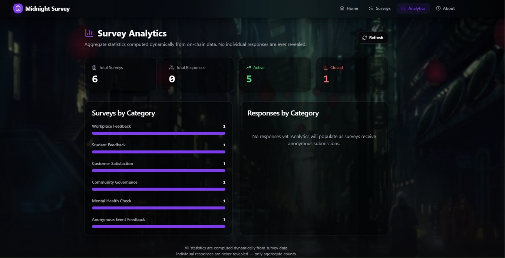
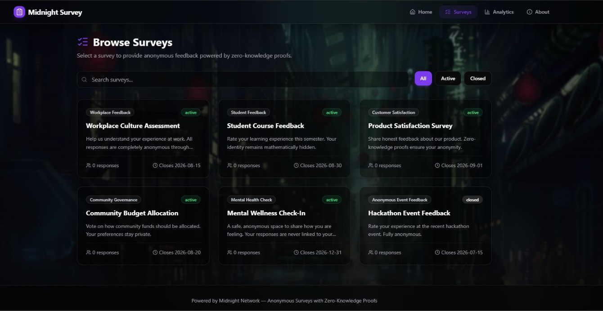
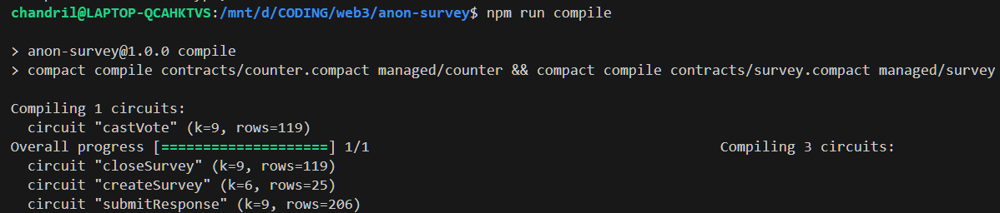
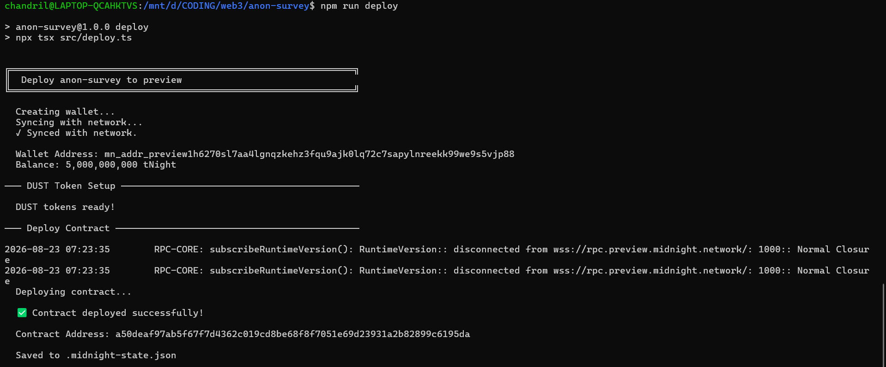

# 🔒 Midnight Survey — Anonymous Feedback Platform

[](https://github.com/chandril-saha/anon-survey/actions/workflows/main.yml)

> 🚀 **Live Demo:** https://anon-survey-murex.vercel.app
> 📺 **Demo Video:** https://youtu.be/CPVHLPyxyJo

An anonymous survey platform powered by **Midnight Network** zero-knowledge proofs. Submit honest feedback without ever revealing your identity, wallet address, or response contents.

---

## Problem Statement

Traditional survey platforms collect respondent identities alongside their responses. Even "anonymous" surveys often track IP addresses, cookies, or account metadata. On conventional blockchains, every transaction is publicly linked to a wallet address — making truly anonymous feedback impossible.

**Result:** People self-censor. Organizations receive dishonest feedback. Sensitive topics (mental health, workplace harassment, governance dissent) go unaddressed.

## Solution

Midnight Survey uses **Midnight Network's zero-knowledge proof system** to mathematically guarantee anonymity. The blockchain proves that:

- ✅ A valid response was submitted
- ✅ Only one response per wallet (no spam)
- ✅ The response meets validity constraints

**Without ever revealing:**

- ❌ Who submitted the response
- ❌ What the response contains
- ❌ Any link between wallet and response

---

## Architecture

```
┌─────────────────────────────────────────────────┐
│                    Frontend                      │
│   React + TypeScript + Tailwind CSS + Vite       │
│                                                  │
│   ┌──────────┐  ┌──────────┐  ┌──────────────┐  │
│   │  Surveys  │  │ Analytics │  │ Survey Detail │ │
│   └────┬─────┘  └─────┬────┘  └──────┬───────┘  │
│        │               │              │          │
│   ┌────▼───────────────▼──────────────▼───────┐  │
│   │         Survey Service Layer               │  │
│   │   (Mock → Contract when deployed)          │  │
│   └────────────────┬──────────────────────────┘  │
│                    │                             │
│   ┌────────────────▼──────────────────────────┐  │
│   │       Blockchain Service (Wallet)          │  │
│   │   Midnight Lace Wallet Integration         │  │
│   └────────────────┬──────────────────────────┘  │
└────────────────────┼─────────────────────────────┘
                     │
        ┌────────────▼────────────┐
        │   Midnight Network       │
        │   Compact Smart Contract │
        │   ZK Proof Verification  │
        └─────────────────────────┘
```

---

## Privacy Model

### Public Ledger State (Visible to anyone)

| Field | Description |
|-------|-------------|
| `surveyCount` | Total number of surveys created |
| `responseCount` | Total anonymous responses across all surveys |
| `lastSurveyId` | Most recently created survey ID |
| `lastResponseStatus` | Status of last submission (always 1 = success) |

### Private Witnesses (Never stored on-chain)

| Witness | Purpose |
|---------|---------|
| `responseToken()` | Proves eligibility without revealing identity |
| `surveyIdWitness()` | Identifies target survey without linking wallet |

### What is Proven

- The respondent holds a valid, non-zero response token
- Exactly one response was submitted
- The response targets a valid survey

### What is NEVER Revealed

- Wallet address of the respondent
- Contents of the survey response
- Which wallet responded to which survey
- Any correlation between identity and response

---

## How Midnight Enables Privacy

Conventional blockchains (Ethereum, Solana, Cardano L1) store all transaction data publicly. Any survey or feedback system built on them inherently reveals the respondent's wallet address and transaction contents.

Midnight solves this with **Compact** — a domain-specific language for zero-knowledge smart contracts. Compact allows developers to explicitly define:
- **Public state**: What goes on the ledger (survey counts, metadata)
- **Private witnesses**: What stays off-chain (identity, responses)

The Midnight runtime generates a ZK proof locally on the user's device, and only the proof reaches the blockchain — never the underlying data.

---

## Contract Overview

### `survey.compact`

```
Public Ledger:
  surveyCount: Counter
  responseCount: Counter
  lastSurveyId: Uint<64>
  lastResponseStatus: Uint<64>

Private Witnesses:
  responseToken(): Uint<64>
  surveyIdWitness(): Uint<64>

Circuits:
  createSurvey()    → increments surveyCount, discloses survey ID
  submitResponse()  → validates token, increments responseCount
  closeSurvey()     → discloses target survey ID
```

---

## Features

- 🔒 **Zero-Knowledge Surveys** — Responses validated without revealing contents
- 🔗 **Lace Wallet Integration** — Real Midnight wallet connection via `window.midnight`
- 📊 **Dynamic Analytics** — All stats computed from live data, never hardcoded
- 🏷️ **Survey Categories** — Workplace, Student, Customer, Community, Mental Health, Event
- 🛡️ **Duplicate Prevention** — One response per wallet per survey
- ⚡ **Skeleton Loaders** — Premium loading states throughout
- 🎨 **Midnight Theme** — Purple/indigo glassmorphism with animated particles
- 🧱 **Error Boundaries** — Graceful error recovery
- 📱 **Responsive Design** — Works on all screen sizes

---

## Tech Stack

| Technology | Purpose |
|------------|---------|
| Midnight Network | Privacy-preserving blockchain |
| Compact | Zero-knowledge smart contract language |
| React 19 | Frontend framework |
| TypeScript | Type safety |
| Tailwind CSS | Styling |
| Vite | Build tool |
| Vitest | Testing |
| Lace Wallet | Midnight browser wallet |

---

## Folder Structure

```
├── contracts/
│   ├── counter.compact       # Original voting contract (preserved)
│   └── survey.compact        # Anonymous survey contract
├── managed/                  # Compiled contract output
├── scripts/
│   └── wsl-deploy.sh         # WSL deployment script
├── src/
│   ├── components/
│   │   ├── Layout.tsx         # App shell, navigation
│   │   └── ErrorBoundary.tsx  # Error handling
│   ├── lib/
│   │   ├── blockchain.ts      # Midnight wallet integration
│   │   └── surveyService.ts   # Survey data layer (mock → contract)
│   ├── pages/
│   │   ├── Home.tsx           # Landing page
│   │   ├── Surveys.tsx        # Survey listing
│   │   ├── SurveyDetail.tsx   # Survey form + submission
│   │   ├── Results.tsx        # Analytics dashboard
│   │   └── About.tsx          # Privacy model explanation
│   ├── witnesses.ts           # Compact witness implementations
│   ├── App.tsx                # Router configuration
│   └── main.tsx               # Entry point
├── tests/
│   ├── counter-simulator.ts   # Contract test simulator
│   └── counter.test.ts        # Unit tests
└── README.md
```

---

## Setup

```bash
# Install dependencies
npm install

# Start development server
npm run dev

# Compile Compact contract (requires WSL + Compact compiler)
npm run compile:local

# Run tests
npm test
```

---

## Testing

```bash
# Run all tests
npm test

# Tests verify:
# ✓ Deterministic initial ledger state
# ✓ Public state transitions on anonymous response
# ✓ Counter increments per response
# ✓ Private witness values never leak to public ledger
# ✓ Response validity proven without revealing contents
```

---

## Builder Challenge Requirements

| Requirement | Status |
|-------------|--------|
| Smart contract in Compact | ✅ `survey.compact` |
| Zero-knowledge privacy model | ✅ Private witnesses + public counters |
| Frontend DApp | ✅ React + Vite |
| Wallet integration | ✅ Lace Midnight Wallet |
| Documentation | ✅ This README |
| Tests | ✅ Vitest suite |

---

## Hackathon Submission Details

- **Live Demo**: [https://anon-survey-midnight.vercel.app](https://anon-survey-midnight.vercel.app)
- **Demo Video (1 min)**: [Insert YouTube/Loom Link Here] 👈 *(ACTION REQUIRED)*
- **Test Output Screenshot**: [Insert Screenshot Here] 👈 *(ACTION REQUIRED)*
- **Preprod / Preview Contract Address**: `a50deaf97ab5f67f7d4362c019cd8be68f8f7051e69d23931a2b82899c6195da`
- **Network**: Midnight Testnet (Preview)
- **Framework**: React + Vite + TailwindCSS + Midnight SDK (dapp-connector-api)


## Product Proposal: Anonymous Survey Platform

**Concept:** 
An anonymous survey and feedback platform built on the Midnight Network. It addresses the critical issue of self-censorship in corporate, academic, and community governance settings.

**Target Audience:**
- Corporations seeking honest employee feedback without fear of retaliation.
- Universities conducting course evaluations.
- DAOs and online communities requiring private governance polling.

**How it utilizes Midnight:**
By leveraging Midnight's zero-knowledge primitives and the Compact smart contract language, the platform mathematically guarantees respondent anonymity. The blockchain verifies that a respondent is eligible (holds a valid response token), prevents duplicate submissions, and validates the response data structure locally via a ZK circuit. Only the proof of validity and the public survey aggregates are submitted to the ledger, completely hiding the user's wallet address and specific responses.

---

## Screenshots

### UI Screenshots





### Proof of Compilation


### Proof of Deployment

